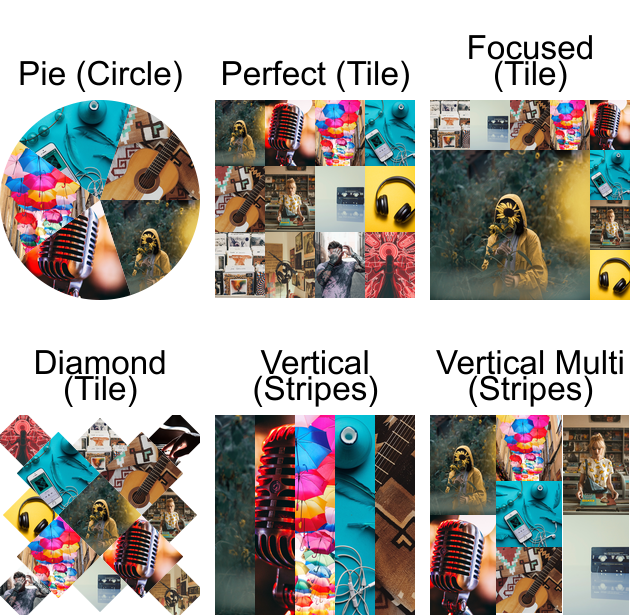

# mosaic

[](https://goreportcard.com/report/github.com/gieseladev/mosaic)
[](https://godoc.org/github.com/gieseladev/mosaic)


A collage generator primarily designed to generate stunning playlist thumbnails


## Composers

<p align="center">
    
</p>


## Command Line

The command to generate a composition is simple:
```bash
mosaic generate --output <file> <image>...
```

This will generate a composition with a suitable composer (for the given
amount of images) and save it at the given location.

The following options are available.

```bash
OPTIONS:
    --composer value, -c value  use specific composer (default: random)
    --output value, -o value    path to write output image to
    --width value               width of composition (default: 512, or same as height if set)
    --height value              height of composition (default: 512, or same as width if set)
    --help, -h                  show help (default: false)
```

Use `mosaic generate -h` for more details.
